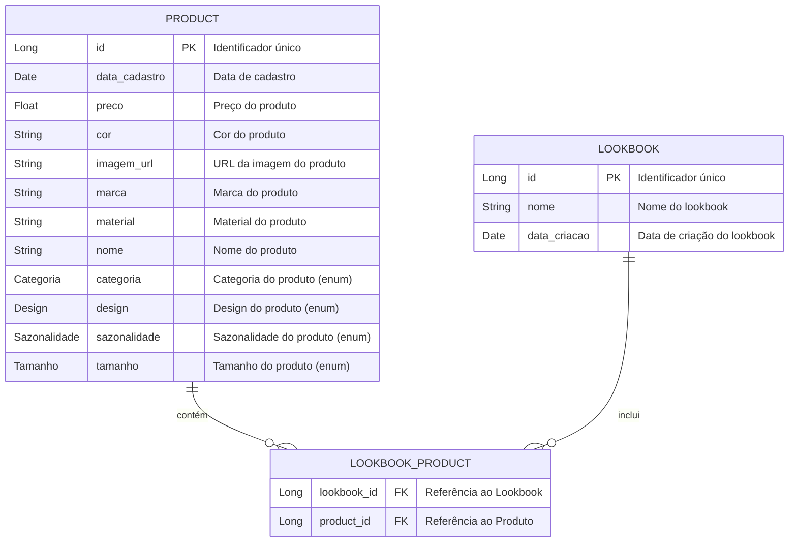

# 🎨 Lookbook Trend : Gerencie seus Looks

**Lookbook Trend** é uma aplicação inovadora que permite aos usuários explorar e gerenciar looks de moda, tudo enquanto segue as últimas tendências do mercado! 🌟

## 🚀 Funcionalidades

- **Exploração de Looks**: Navegue por uma coleção diversificada de looks inspiradores. 👗👖
- **Recomendações Personalizadas**: Receba sugestões de looks com base nas suas preferências. 🎉
- **Experiência de Usuário Intuitiva**: Navegação fácil e design responsivo para todos os dispositivos. 📱💻

---

## 📚 Estrutura do Banco de Dados

A aplicação utiliza um modelo de banco de dados relacional para gerenciar as informações dos produtos, lookbooks e suas interações. Abaixo está o diagrama de Entidade e Relacionamento com as tabelas principais da estrutura do banco de dados:

---

## 🛠 Tecnologias Utilizadas

- **Java**: A linguagem de programação principal da aplicação. ☕
- **Spring Boot**: Para construção de APIs e gerenciamento de dependências. 🚀
- **Thymeleaf**: Para renderização de templates no lado do servidor. 📜
- **Oracle SQL**: Banco de dados relacional para armazenamento e gerenciamento eficiente de dados. 🗄️
